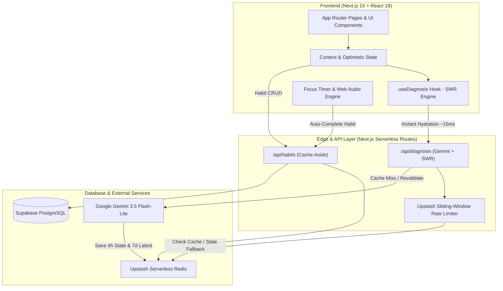

<div align="center">

# 🏛️ Zenith — Circadian Habit & Usable Working Window System

**A proactive behavioral consistency engine built for real-world schedules — planned around your usable hours, not artificial 24-hour days.**

[](https://nextjs.org/)
[](https://react.dev/)
[](https://www.typescriptlang.org/)
[](https://tailwindcss.com/)
[](https://supabase.com/)
[](https://upstash.com/)
[](https://ai.google.dev/)
[](LICENSE)

[Live Demo](https://zenith-habits.vercel.app) · [Report Bug](https://github.com/SamarSiddiqui/Zenith/issues) · [Request Feature](https://github.com/SamarSiddiqui/Zenith/issues) · [Discussions](https://github.com/SamarSiddiqui/Zenith/discussions)

</div>

---

## 📖 The Problem & The Zenith Philosophy

Most habit trackers on the market (Streaks, Loop, Habitica) are built on a flawed foundation: **the empty 24-hour canvas and fragile binary streaks**.

```
Traditional Flow:  Create Habit ──▶ Track ──▶ Busy Workday ──▶ Slip Day ──▶ Streak = 0 ──▶ Guilt ──▶ Abandon App
Zenith Flow:       Map Window ──▶ Track ──▶ Work Overrun ──▶ 2-Day Warning ──▶ Shrink / Recover ──▶ 100% Retained
```

### Why Traditional Trackers Fail:
1. **The 24-Hour Myth**: Assuming an open 24 hours leads people to schedule 90 minutes of habits into days already packed with 10 hours of work, commute, and errands.
2. **Binary Streak Guilt**: When a 30-day streak resets to `0` because of an unexpected flight or late meeting, dopamine collapses and users abandon the habit entirely (*the "What-the-Hell" effect*).
3. **Willpower Blame**: Traditional apps blame lack of discipline rather than diagnosing contextual schedule friction (e.g. evening energy crashes after 7 PM finishes).

### How Zenith Solves This:
- ⏳ **Usable Working Window**: Calculates remaining realistic time gaps after work and commitments.
- 📈 **Habit Health Index (0–100%)**: Multi-variable weighted curve with decay and gradual recovery instead of destructive binary resets.
- 🛡️ **Proactive 2-Day Early Warning**: Intervenes on slip #2 while recovery still takes one frictionless step.
- ⚡ **"Shrink, Don't Skip" Fallbacks**: Automatically scales habits down to 2-minute or 5-minute identity anchors during schedule crunches.
- 🧠 **AI Schedule Diagnosis (Gemini 3.5 Flash-Lite)**: Cross-references habit history with workday end times to pinpoint schedule collisions with zero shame or blame.

---

## ⚡ Core Feature Matrix

| Feature Module | Route | Key Capabilities | Technical Highlights |
| :--- | :--- | :--- | :--- |
| **Usable Window Dashboard** | `/dashboard` | • Real-time usable time calculation<br>• 2-Day consecutive miss risk alerts<br>• 30-day health sparkbars & completion ring | Non-blocking client-side health calculations with optimistic UI updates |
| **Interactive Habits Matrix** | `/habits` | • 7-day cyclical status matrix (`Done`, `Missed`, `Shrunk`, `Deferred`)<br>• Contextual "Why did you skip?" modal<br>• "Shrink, Don't Skip" 2-min fallback switch | Single-query batch logging with Supabase cache invalidation via Redis |
| **AI Diagnosis & Reflection Engine** | `/diagnosis` | • Gemini-powered Schedule Friction Autopsy<br>• Circadian Zone Heatmaps (Morning/Afternoon/Evening)<br>• 1-Click slot shifts & micro-version injectors | **Stale-While-Revalidate (SWR)** caching layer via Redis with sub-15ms initial hydration |
| **Adaptive 3-Day Recovery Mode** | `/recovery` | • Guided Step-Up ramp: Day 1 (Micro) $\rightarrow$ Day 2 (Half) $\rightarrow$ Day 3 (Full)<br>• Interactive 4-4-4 Box Breathing Pacer<br>• Visual Health Restoration Simulator | State-driven recovery progression linked directly to habit health recovery curve |
| **Evening Focus Organizer** | `/dashboard` | • Auto-activates after 19:30 based on remaining evening window<br>• 1-Click "Finish Evening in 30 Mins" timed queue<br>• Quick-compress all habits to 2-min versions | Time-aware dynamic queue sequencer |
| **Philosopher Focus Sanctuary** | `/focus` | • 5 Flow Archetypes (Pomodoro, Deep Work, Stoic, Ultradian, Custom)<br>• Procedural SVG Forest Tree Canvas (5 Species, 5 Growth Stages)<br>• Zero-dependency Web Audio Soundscapes (Rain, Forest, Alpha Waves)<br>• Live browser tab timer & global floating widget | Millisecond-accurate timestamp diffing proofed against background browser throttling |
| **Sprint Planner & Cadence** | `/sprint` | • Weekly/Monthly sprint goal setting<br>• Day-of-week cadence mapping<br>• End-of-sprint retrospective scorecard | ISO 8601 sprint boundary calculations with timezone normalization |
| **Schedule & Window Settings** | `/settings` | • Customizable working hours & sleep boundaries<br>• Weekday vs. Weekend custom profiles<br>• Identity motive anchors & JSON export | LocalStorage persistence with Supabase cloud backup sync |

---

## 🏛️ System Architecture



---

## 🔬 Engineering & Performance Highlights

### 1. Dual-Layer Stale-While-Revalidate (SWR) AI Caching
- **The Problem**: AI synthesis calls to LLMs typically take **2,500ms – 4,000ms**, creating jarring full-screen loading spinners when returning to the app after 12+ hours.
- **The Solution**: 
  - **Instant Hydration (~15ms)**: On page load, `useDiagnosis` serves the last-known reflection snapshot from `zenith:diag:latest:${userId}` (7-day TTL) or local storage.
  - **Non-Blocking Background Revalidation**: A background worker hashes current habit state (`FNV-1a 32-bit`) and queries Gemini 3.5 Flash-Lite only if state changed.
  - **Smooth Hot-Swap**: Cards update in-place with a subtle `✓ Updated just now` toast without unmounting the UI.

### 2. Browser-Throttling Proof Focus Timer
- **The Problem**: Chrome, Safari, and Edge throttle `setInterval` / `setTimeout` to once every 1,000ms or suspend timers entirely in inactive background tabs.
- **The Solution**: Zenith's `FocusContext` computes remaining seconds dynamically against a fixed millisecond target timestamp (`Date.now() - targetEndTimeRef`). Tab re-focus and `visibilitychange` events perform delta correction to maintain 100% time accuracy.

### 3. Zero-Dependency Web Audio Synthesizer
- Built natively using the browser's **Web Audio API** (`AudioContext`, `BiquadFilterNode`, `GainNode`, `PeriodicWave`).
- Synthesizes procedural white/pink noise, resonant bandpass filters for rain and forest breeze, and pure 432Hz sine tones for alpha wave entrainment without downloading large static MP3 assets.

### 4. Sliding-Window Rate Limiting
- Protected at the Edge with `@upstash/ratelimit` enforcing a sliding window of **10 requests per 10 minutes** per user.
- If a rate limit is exceeded, Zenith gracefully falls back to the user's latest cached reflection rather than throwing a blocking error.

---

## 🛠️ Technology Stack

| Domain | Technology | Purpose |
| :--- | :--- | :--- |
| **Framework** | [Next.js 15 (App Router)](https://nextjs.org/) | Server Components, Streaming SSR, Edge API Routes |
| **Library** | [React 19](https://react.dev/) | React Server Actions, `useCallback`, `useMemo`, Transitions |
| **Language** | [TypeScript 5](https://www.typescriptlang.org/) | Strict type safety, discriminated unions, zero `any` |
| **Styling** | [Tailwind CSS 3.4](https://tailwindcss.com/) | Custom design tokens, glassmorphism, responsive utilities |
| **Animations** | [Framer Motion 12](https://www.framer.com/motion/) | Layout animations, micro-interactions, canvas transitions |
| **Database** | [Supabase (PostgreSQL)](https://supabase.com/) | Relational habit data, row-level security (RLS), Auth |
| **Caching & Rate Limiting** | [Upstash Redis](https://upstash.com/) | Serverless edge cache, SWR AI reflection storage, sliding rate limit |
| **AI Intelligence** | [Google Gemini 3.5 Flash-Lite](https://ai.google.dev/) | Low-latency structured JSON reflections, schedule collision diagnostics |
| **Audio Engine** | [Web Audio API](https://developer.mozilla.org/en-US/docs/Web/API/Web_Audio_API) | Native procedural soundscape synthesis (Rain, Forest, Alpha Waves) |
| **Icons & UI** | [Lucide React](https://lucide.dev/) | Consistent, lightweight iconography |

---

## 🚀 Getting Started

### Prerequisites
- **Node.js**: `v18.18.0` or higher
- **npm**, **pnpm**, or **yarn**
- *(Optional)* Supabase and Upstash Redis accounts for full cloud synchronization

### Installation

1. **Clone the Repository**:
   ```bash
   git clone https://github.com/SamarSiddiqui/Zenith.git
   cd Zenith
   ```

2. **Install Dependencies**:
   ```bash
   npm install
   ```

3. **Configure Environment Variables**:
   Create a `.env.local` file in the root directory:
   ```env
   # Google Gemini API
   GEMINI_API_KEY="your-gemini-api-key"

   # Supabase Credentials (Optional for local-first mode)
   NEXT_PUBLIC_SUPABASE_URL="https://your-project.supabase.co"
   NEXT_PUBLIC_SUPABASE_ANON_KEY="your-supabase-anon-key"

   # Upstash Serverless Redis (Optional for local cache)
   UPSTASH_REDIS_REST_URL="https://your-redis-instance.upstash.io"
   UPSTASH_REDIS_REST_TOKEN="your-upstash-token"
   ```

4. **Run the Development Server**:
   ```bash
   npm run dev
   ```
   Open [http://localhost:3000](http://localhost:3000) in your browser.

5. **Typecheck & Validate**:
   ```bash
   npx tsc --noEmit
   ```

---

## 🤝 Contributing & Community

Contributions are what make the open-source community such an amazing place to learn, inspire, and create. Any contributions you make are **greatly appreciated**.

### How to Contribute:
1. **Fork the Project**
2. **Create your Feature Branch**:
   ```bash
   git checkout -b feat/AmazingFeature
   ```
3. **Commit your Changes**:
   ```bash
   git commit -m "feat: Add some AmazingFeature"
   ```
4. **Push to the Branch**:
   ```bash
   git push origin feat/AmazingFeature
   ```
5. **Open a Pull Request**

### 💬 Discussions & Issues
- Have an idea for a new feature or want to discuss circadian habit science? [Join our GitHub Discussions](https://github.com/SamarSiddiqui/Zenith/discussions).
- Found a bug or glitch? [Open an Issue](https://github.com/SamarSiddiqui/Zenith/issues).

---

## 📜 License

Distributed under the **MIT License**. See [`LICENSE`](LICENSE) for more information.

---

<div align="center">

### Developed with 🖤 by [Samar Siddiqui](https://github.com/SamarSiddiqui)

*Built to help practitioners reach their personal Zenith through compassionate, schedule-grounded consistency.*

</div>
